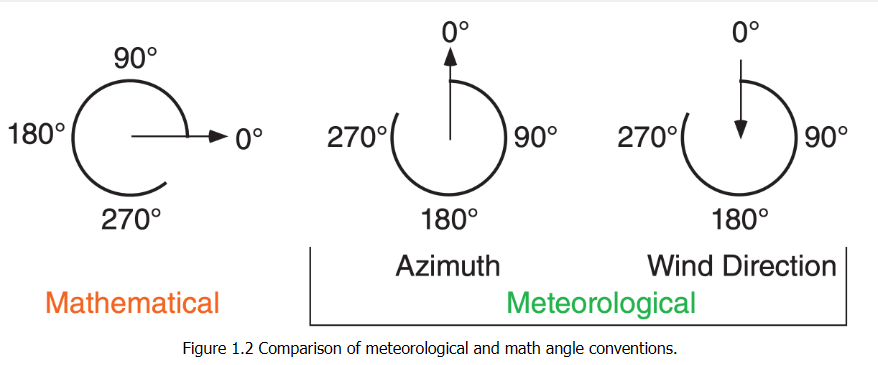

# vector_math_anemo.py explanation

## This file is explaining the core mechanics of the vector math calculation

- Each Division will be dedicated to one part of the direction calculation, starting from first calculation

```direction = (math.degrees(math.atan2(v,u)) + 360) % 360```

## (v,u)

- The v and u values are the most important part of the equation as they the primary data being used for the calculation
- Earlier when we parse the anemometer file, we get two vectors. Namely v and u. u is the directional component on the x-axis, and v is the y-axis.

### v (The Y axis(north,south))

- A positive `v` value, means the wind is **north ward** as it is coming from the south.
- A negative `v` value, means the wind is **south ward** as it is coming from the north.

### u (The X axis(west,east))

- We can apply this logic to the `u` value.
- A positive `u` value has a **east ward** blowing wind, as it is coming from the west.
- A negative `u` value has a **east ward** blowing wind, as it is coming from the east.

## math.atan2()

- The math.atan2() function returns an angle on a plane in ***radians***(i.e., it will give us a value in the range of [-180,+180]).
- Most of the time, when we use `atan2()`, we pass in the `y` value first. This is so we can get an angle from the `X-axis`
- In this case however, we pass in the `x` value first, so we can get the angle from north

- refer to this diagram for why we do this



## + 360

- In the `math.atan2()` part, there is a possibility that we get a negative radians.
- This make our lives easier as it changes all our negative angles([-180,+180]) into positive ones[180,540].
- If we have an angle thats already greater than 0(adding 360 will equal a value greater than 360), we have a safety net later to prevent surprises.

### "But why not add 180????"

- Adding 180 can and will fix the problem with our negative values, but as we want to be more intuitive to the users. We are displaying the direction the wind is *blowing* instead of the meterological standard of where the wind is *coming from*.
- Adding 360 instead of 180 flips the angle from facing into the wind, to facing the way the wind is facing.

## math.degrees()

- As mentioned earlier, `math.atan2()` returns an angle in ***radians***. So we must convert it to degrees.

## % 360

- The `%` or the "modulo operator" normalizes our angle into the range of [0,360].
- It does this by dividing what we get from `math.degrees()` by `360` and returning the remainder.
- An example would be `400 % 360` would be `1` with a remainder of `40`
